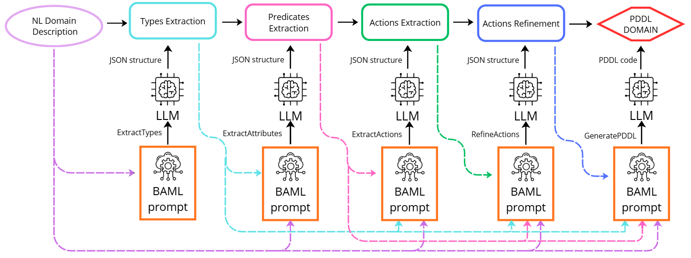
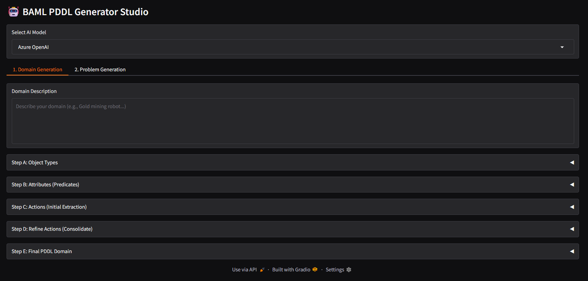

# PDDL Domain Generator: NL to PDDL via Modular LLM Pipeline

This project implements an automated knowledge engineering pipeline for converting Natural Language (NL) domain descriptions directly into syntactically valid and semantically rich Planning Domain Definition Language (PDDL) models.

The methodology is based on a modular Chain-of-Thought (CoT) architecture orchestrated by BAML (Built-in AI Markup Language), which ensures structural consistency at every stage.




START-UP INSTRUCTIONS


1\. Prerequisites

You need to have Python installed (3.10+ recommended), installed the VSCode BAML extension, and configured the API keys for your LLM models (Azure, Gemini, or Deepseek) as environment variables.


2\. Repository setup

Clone the repository and configure BAML:

```bash

git clone https://github.com/giadatroilo/NL2PDDL.git

cd NL2PDDL

baml configure 

```


3\. Launching the Graphical Interface (Gradio)

The tool is run via a local web interface based on Gradio.

```bash

python app.py 

```


After launching, the interface will be accessible in your browser (usually at http://127.0.0.1:7860).




4\. Using the Tool

\- Select the AI ​​Model (Azure, Gemini, or Deepseek).


\- Enter the Domain Description (NL).


\- Follow the steps under the "Domain Generation" tab sequentially (Step A → E).


\- The output of each step will be a structured JSON that serves as input for the next step. You can send feedback and directly modify the output of each step if desired.

